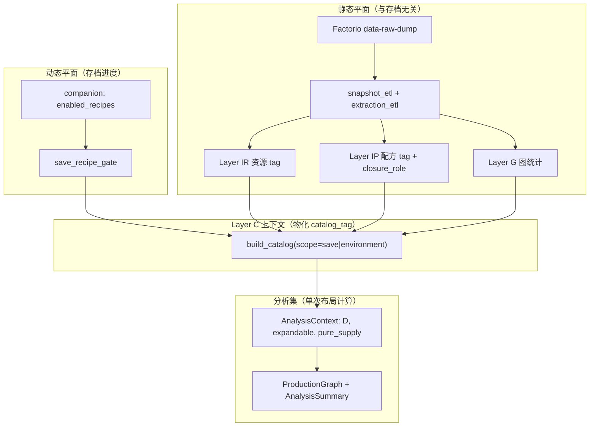

# 分析集与 Tag 体系设计（完整参考）

> 规则版本：`tag_rule_version = 3` · Schema：`schema_final` v3  
> 相关实现：`db/intrinsic/` · `db/extraction_etl.py` · `db/catalog_builder.py` · `core/analysis_engine.py`

本文档是**分析集（Analysis Set）**与**游戏 Tag 四层体系**的对照规范。后续改 UI、闭包、catalog 时以此为准，避免把「游戏世界原料」「Catalog 上下文 tag」「运行时 supply 节点」混为一谈。

---

## 0. 总览：数据从哪来，分析集是什么



**分析集** = 在某次 `compute_layout` / `run_analysis` 中，由 **AnalysisContext** 限定的物品集合 + 对用户选择（产出目标、已知供给、禁止供给、supply_mode）做 **反向闭包** 后得到的：

- 参与物品集合 `analysis_items`
- 生产图 `ProductionGraph`（`producer:*` / `supply:*`）
- 摘要 `AnalysisSummary`（纯粹原料、有效终端、配方指派等）

分析集 **不是** 数据库里的一张表；它是 **Context tag + 用户输入 + 闭包算法** 的运行时结果。

---

## 1. 四层 Tag 体系

| 层 | 代号 | 存储 | 计算时机 | 是否依赖存档 |
|----|------|------|----------|--------------|
| IR | Intrinsic Resource | `snap_resource_intrinsic_tag` | snapshot ETL | 否 |
| IP | Intrinsic Recipe | `snap_recipe_intrinsic_tag` + `snap_recipe_closure_role` | snapshot ETL | 否 |
| G | Graph stats | `snap_resource_stats` / `snap_resource_stats_primary` | snapshot ETL | 否 |
| C | Context | `catalog_tag`（经 `catalog_build` 物化） | 导入存档 / rebuild catalog | **是**（save scope） |

统一资源模型：`snap_resource` 中 **item 与 fluid 同级**（`kind ∈ {item, fluid}`），配方流 `snap_recipe_flow` 中二者均可作为 in/out。

---

## 2. Layer IR — 资源固有语义（游戏静态）

来源：原型 dump + `resource_classifier` + `extraction_etl`。

### 2.1 IR Tag 一览

| Tag | 含义 | 游戏数据依据 |
|-----|------|--------------|
| `ir.internal` | 内部/参数项 | `parameter-*`、`visibility=internal` |
| `ir.item` | 物品 | `kind=item` |
| `ir.fluid` | 流体 | `kind=fluid` |
| `ir.extractable` | 世界可抽取 baseline | 见下表 |
| `ir.container.barrel` | 桶装容器 | 名称 `*-barrel`；`params.content_fluid` |

### 2.2 `ir.extractable` 判定（世界原料，静态）

**满足任一：**

| 条件 | 游戏数据来源 |
|------|--------------|
| 出现在 `snap_resource_extraction` | `resource` 实体 `minable.result/results`；`offshore-pump` → water；与 `mining-drill.resource_categories` 关联 |
| `item.subgroup = raw-resource` | dump 物品原型 |
| 名称以 `-ore` / `-brine` 结尾 | 命名规则（太空时代卤水等） |

**明确不是 extractable：**

- 流体原型仅 `subgroup=fluid`（石油气、轻油、硫酸等）
- 仅由 **带原料输入的 primary 配方** 产出的中间物

### 2.3 世界抽取表（IR 的实体依据）

| 表 | dump 来源 | 作用 |
|----|-----------|------|
| `snap_map_resource` | `type=resource` | 矿脉、油井等地图资源实体 |
| `snap_extractor` | `mining-drill`, `offshore-pump` | 抽油机、采矿机、海上泵 |
| `snap_resource_extraction` | 上二者推导 | 资源 ↔ 抽取建筑 ↔ 产出物 |
| 合成配方 `fb-extract:{name}` | 工具生成 | 零原料 `mining`/`pumping`，闭包内代表「从世界抽取」 |

---

## 3. Layer IP — 配方固有语义（游戏静态）

来源：配方 `category`、名称模式、输入输出流。

### 3.1 IP Tag 一览

| Tag | 含义 | 游戏数据依据 |
|-----|------|--------------|
| `ip.extract` | 抽取类 | `fb-extract:*`；category `mining`/`pumping`；零原料多产出 |
| `ip.smelting` | 冶炼 | category `smelting` |
| `ip.refining` | 炼油 | category `oil-processing` 等 |
| `ip.chemistry` | 化工 | category `chemistry` |
| `ip.craft` | 制造 | `crafting`、`electronics` 等 |
| `ip.barrel.fill` / `ip.barrel.empty` | 装桶 / 倒桶 | 名称 `fill-*-barrel` / `empty-*-barrel` |
| `ip.excluded` | 排除 | 预留 |

### 3.2 `closure_role`（闭包是否展开此配方）

| closure_role | 条件 | 闭包行为 |
|--------------|------|----------|
| `primary` | 默认；非桶装 | **参与**反向闭包展开 |
| `logistics` | 桶装 fill/empty | **永不**参与闭包（含倒桶出水） |
| `excluded` | 预留 | 不参与 |

**分析集硬规则：** 闭包内只走 `closure_role=primary` 的配方（含 `fb-extract:*`）。

### 3.3 配方入库范围

凡 **产出 item 或 fluid** 的可见配方均进入 `snap_recipe`（含 `basic-oil-processing` 等纯流体配方）。  
此前仅收 item 产出会导致炼油链断裂——属于工具逻辑，非游戏限制。

---

## 4. Layer G — 全图统计（游戏静态）

| 表 | 字段 | 含义 |
|----|------|------|
| `snap_resource_stats` | `recipes_as_output` / `recipes_as_input` | 全 snapshot 配方图中的入度/出度 |
| `snap_resource_stats_primary` | 同上，仅 primary 配方 | 闭包 relevant 统计 |

Context tag `producible` / `consumable` 来自 G 层。

---

## 5. Layer C — 分析上下文（Catalog，依赖 gate）

物化：`build_catalog(scope_kind, scope_key, env_key)` → `catalog_tag`。

### 5.1 Gate 与 scope

| scope_kind | scope_key | gate 定义 |
|------------|-----------|-----------|
| `save` | `save_key` | `save_recipe_gate` = companion 导出的 `enabled_recipes` |
| `environment` | `env_key` | 该 snapshot 下 **全部** 配方 |

从 gate 配方流推导集合：

| 集合符号 | 定义 |
|----------|------|
| `primary_out(M)` | M 是 gate 内 **primary** 配方的产物（item/fluid） |
| `logistics_out(M)` | M 仅由 logistics 配方产出 |
| `used_input(M)` | M 在 gate 内作为某配方原料 |
| `extractable_out(M)` | M 在 `snap_resource_extraction`，且 gate 内已解锁对应 `extractor_entity`（如 `pumpjack`） |
| `closure_expandable(M)` | `M ∈ primary_out ∪ extractable_out` |
| `baseline(M)` | `ir.extractable` 在 M 上成立 |
| `pure_supply(M)` | `baseline(M) ∧ ¬closure_expandable(M)` |

### 5.2 Context Tag 完整定义

| Context tag | 公式 / 条件 | 分析集角色 |
|-------------|-------------|------------|
| `internal` | `visibility=internal` | 不参与 UI / 闭包 |
| `producible` | G: 至少一条配方产出 | 图结构信息 |
| `consumable` | G: 至少作为一次原料 | 图结构信息 |
| `craftable` | `primary_out` 或（`closure_expandable ∧ baseline`） | 当前进度「做得出来」 |
| `craftable_logistics_only` | 仅 `logistics_out` | 桶装路径，不展开 |
| `used_as_input` | gate 内作原料 | 中间物候选 |
| `baseline_supply` | `ir.extractable` | 静态世界 baseline |
| `pure_supply` | `baseline ∧ ¬closure_expandable` | **默认**当外部供给 |
| `closure_expandable` | 见上 | 闭包应 **manufacture** 而非默认 supply |
| `intermediate` | `closure_expandable ∧ used_as_input` | **多级中间产物**（Catalog 语义） |
| `terminal` | `closure_expandable ∧ ¬used_as_input` | Catalog 内「不再被消耗」的可产物 |
| `manufacture` | `closure_expandable ∧ ¬barrel` | UI「产出目标」列表 |
| `supply` | `(baseline ∨ used_as_input ∨ pure_supply) ∧ ¬terminal` | UI「已知外部供给」候选 |

**注意：** Catalog 的 `terminal` / `intermediate` 描述的是 **在当前 gate 的全局配方图** 中的角色，与 **单次分析的有效终端**（见 §7.3）不完全相同。

### 5.3 数据源 D（AnalysisContext.data_source）

`compute_scope_resource_names()` 返回三元组，供分析使用：

| 字段 | save scope | environment scope |
|------|------------|-------------------|
| `data_source` (D) | `closure_expandable ∪ used_input ∪ pure_supply ∪ baseline` | 全图 normal 资源 ∪ expandable ∪ input |
| `closure_expandable` | 上式子集 | 上式子集 |
| `pure_supply` | `baseline ∧ ¬closure_expandable` | 同上 |

**分析集边界：** 闭包中遇到的物品必须在 `D` 内，否则报错「不在当前数据源内」。

---

## 6. 分析集核心概念（运行时）

以下概念出现在 `AnalysisSummary` / `ProductionGraph` / 布局节点中。

### 6.1 与用户输入的关系

| 用户输入 | 字段 | 作用 |
|----------|------|------|
| 产出目标 | `declared_outputs` | 闭包 **根**；必须 `closure_expandable` |
| 已知外部供给 | `user_supplied` | 强制 `supply:*`，不再向上展开 |
| 禁止供给 | `forbidden` | 禁止该物品作 supply；可致 `impossible` |
| 供给模式 | `supply_mode` | `raw` / `direct`（见 §6.5） |
| Catalog 模式 | `catalog_mode` | `progress` → save scope；`full` → environment |

### 6.2 纯粹原料（Pure Source）

分析集里 **不再向上展开** 的输入，对应图节点 `supply:{item}`。

| 概念 | 字段 / 节点 | 定义 |
|------|-------------|------|
| **真实纯粹原料** | `true_pure_sources` | RAW 模式下进入 `supply:*` 的物品 |
| **伪纯粹原料** | `pseudo_pure_sources` | DIRECT 模式下占位 supply |
| **Catalog 默认供给** | `pure_supply`（Context） | 算法 **倾向** 将其作 supply，可被用户 `user_supplied` / 展开 recipe 覆盖 |
| **世界 baseline** | `baseline_supply` / `ir.extractable` | 静态：地图上可抽；**不等于** 一定是 supply 节点 |

#### `resolve_material` 决策顺序（RAW 模式）

```
1. user_supplied           → supply（true_pure）
2. closure_expandable      → manufacture → producer（含 fb-extract:*）
3. pure_supply / baseline  → supply（true_pure）
4. 有 primary 配方         → 尝试 manufacture
5. 兜底                    → supply（true_pure）
```

#### 纯粹原料 vs 世界原料 vs 抽取 producer

| 物品 | ir.extractable | 抽取建筑已解锁 | 闭包中节点 |
|------|----------------|----------------|------------|
| 铁矿 | 是 | 否（仅矿机配方未解锁） | 常作 `supply:*`（true_pure） |
| 原油 | 是 | 是（pumpjack） | `producer:fb-extract:crude-oil` |
| 石油气 | 否 | — | `producer:basic-oil-processing` 等 |
| 铜板 | 否 | — | `producer:*` 或 supply（若用户指定） |

### 6.3 中间产物（Intermediate）

**多级中间产物** = 闭包展开过程中，既 **被制造** 又 **作为下游原料** 的物品。

| 视角 | 标识 | 说明 |
|------|------|------|
| Catalog（静态 gate 图） | `intermediate` tag | `closure_expandable ∧ used_as_input` |
| 分析集（单次闭包） | ∈ `analysis_items`，非 `true_pure`，有 `producer:*` | 如铜板→铜线→绿板链每一环 |
| 布局图 | `type=producer` | 蓝色节点；`fb-extract:*` 带虚线边框 |

**层级：** 由 `layout_engine._assign_layers` 保证物料边 `from → to` 满足 `layer(from) < layer(to)`；行号 `_assign_rows` 减少同层视觉「反向」。

中间产物 **不应** 带 `pure_supply`（除非用户强制 `user_supplied`）。

### 6.4 终端产物（Terminal / Sink）

| 概念 | 字段 / tag | 定义 |
|------|------------|------|
| **声明终端** | `declared_outputs` | 用户在「产出目标」中选择的物品 |
| **有效终端** | `effective_terminals` | 声明终端中，不被其它声明终端「依赖支配」者 |
| **降级终端** | `demoted_outputs` | 被其它声明终端支配者（如同时选绿板和红板，绿板可能 demote） |
| Catalog terminal | `terminal` tag | gate 图内可产物且不再作原料 |
| 布局 sink | `type=sink` | 对应 `effective_terminals` 中的产物，布局最右层 |

支配关系：`compute_effective_terminals()` — 若声明目标 A 的配方链需要声明目标 B，则 B 被 A 支配，B 进入 `demoted_outputs`，不为 B 单独建对外产线。

### 6.5 供给模式 SupplyMode

| 模式 | 行为 |
|------|------|
| `RAW` | 仅 `true_pure` 与真实 supply 节点；尽量展开制造链 |
| `DIRECT` | 中间需求可 `pseudo_pure` 占位，用于直接法/对比 |

### 6.6 其它分析集字段

| 字段 | 含义 |
|------|------|
| `analysis_items` | 闭包内所有涉及物品（supply + 各层中间 + 终端） |
| `recipe_assignments` | 多 primary 配方时 SBTO 选的 `product → recipe` |
| `impossible` | 禁止供给或无法闭包时为 true |

---

## 7. 对照总表：分析概念 ↔ Tag ↔ 游戏数据

| 分析集概念 | Context / IR tag | 游戏数据根 | 图节点类型 |
|------------|-------------------|------------|------------|
| 世界可抽取 | `ir.extractable`, `baseline_supply` | `resource.minable`, `extractor` | — |
| 默认外部供给 | `pure_supply` | baseline + 未解锁制造/抽取 | `supply:*` |
| 用户指定供给 | — | 用户 UI | `supply:*` |
| 世界抽取（已展开） | `closure_expandable`, `ip.extract` | `fb-extract:*` + 抽取建筑解锁 | `producer:fb-extract:*` |
| 一级中间物 | `intermediate`, `closure_expandable` | primary 配方链 | `producer:*` |
| 多级中间物 | 同上，链式多次 | 多级 primary 配方 | 多层 `producer:*` |
| 炼油中间物 | `ip.refining`, `closure_expandable` | `oil-processing` 类配方 | `producer:*` |
| 产出目标 | `manufacture` | 用户选择 + gate 内可造 | 闭包根 |
| 有效终端 | —（运行时 `effective_terminals`） | 用户选择 − demote | `sink` |
| 桶装物流 | `craftable_logistics_only`, `ip.barrel.*` | fill/empty barrel | 不参与闭包 |
| 不参与分析 | `internal` | parameter-* | — |

---

## 8. UI 面板与 Tag 映射

| UI 面板 | `ui_panel.require_tag` | 典型内容 |
|---------|------------------------|----------|
| 产出目标 | `manufacture` | 当前进度可制造的终端候选 |
| 已知外部供给 | `supply`（排除 `terminal`） | baseline、中间物、pure_supply 候选 |
| 全部 | `craftable` | 更广列表 |

布局画布节点样式（约定）：

| 节点 | 条件 | 视觉 |
|------|------|------|
| 世界 baseline supply | `supply` + `meta.supply_kind=world_baseline` | 深绿 + ⛏ |
| 其它 supply | `supply` + implicit | 绿色 |
| 世界抽取 producer | `recipe` 前缀 `fb-extract:` | 蓝 + 虚线 + ⛏ |
| 中间 producer | 普通 primary | 蓝色 |
| 终端 sink | `effective_terminals` | 紫色 |

流动：**左 → 右**；连线 **右出左入**。

---

## 9. 示例：蓝瓶（化工科技包）链

| 物品 | IR | Context（已解锁相关科技） | 分析集中预期 |
|------|----|-----------------------------|--------------|
| 铁矿 | extractable | baseline, pure_supply? | supply 或 矿机链（若展开） |
| 原油 | extractable | expandable（pumpjack） | `fb-extract:crude-oil` |
| 石油气 | — | expandable（炼油） | **producer**，非 supply |
| 水 | extractable | expandable（offshore-pump） | `fb-extract:water` |
| 铜板 | — | intermediate | producer |
| 引擎 | — | intermediate | producer |
| 硫 | — | intermediate | producer |
| 蓝瓶 | — | manufacture | sink（有效终端） |

若 **石油气出现在左侧 supply 列** → 违反本文档：查 gate 是否含炼油配方、流体配方是否入库、`pure_supply` 是否误标。

---

## 10. 决策 Checklist（改代码前）

1. 是否在 `snap_resource_extraction`？→ 世界 baseline，非中间物  
2. 抽取建筑是否在 `save_recipe_gate`？→ 应 `fb-extract` producer  
3. 是否仅由有原料 primary 配方产出？→ 仅 `intermediate` / `closure_expandable`，非 baseline  
4. 是否 `ip.barrel.*`？→ logistics，不闭包  
5. 是否在 `data_source` D 内？→ 否则不应出现在分析集  
6. 声明终端是否被其它终端支配？→ `effective_terminals` vs `demoted_outputs`  
7. 图上 `supply:petroleum-gas`？→ **bug**

---

## 11. 模块索引

| 模块 | 职责 |
|------|------|
| `db/extraction_etl.py` | 世界抽取静态数据、`fb-extract:*` |
| `db/intrinsic/resource_classifier.py` | IR |
| `db/intrinsic/recipe_classifier.py` | IP + closure_role |
| `db/intrinsic/apply.py` | ETL 后写入 IR/IP |
| `db/catalog_builder.py` | Layer C 物化 |
| `db/data_source.py` | `AnalysisContext` |
| `core/analysis_engine.py` | 分析集闭包、纯粹原料、有效终端 |
| `core/layout_engine.py` | 分层、分行、节点 meta |
| `frontend/LayoutCanvas.vue` | 端口方向与样式 |

---

## 12. 修订记录

| 版本 | 变更 |
|------|------|
| v3 | 世界抽取表；流体配方全入库；extractable 来自 extraction 非手写名单 |
| v2 | intrinsic tag + closure primary/logistics |
| v1 | 初版 catalog |
