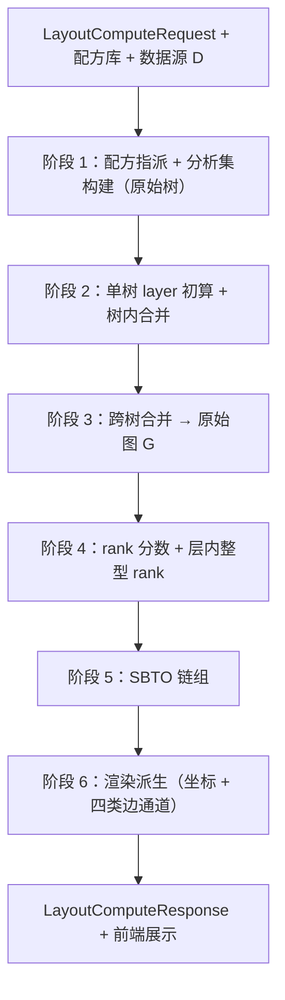
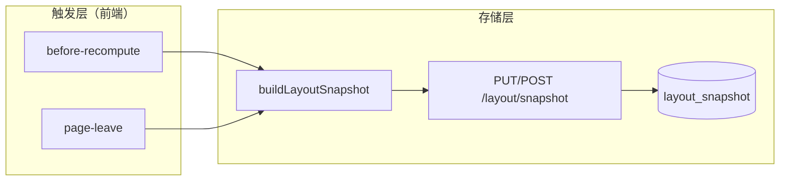

# 异星自平衡布局 — 全流程设计规范 v2

> **状态：** v2 已定稿并 **已实现**（`backend/core/layout_pipeline.py` 串联阶段 1→6）。  
> **原则：** 不兼容旧版语义；模块严格隔离；用户输入仅为 **按需读取的判断数据**。  
> **关联：** 静态 Tag / 数据源定义见 `backend/db/ANALYSIS_SUPPLY_SEMANTICS.md`；本文描述 **单次布局计算** 的运行时流水线。

---

## 0. 文档目的与范围

本文从 **用户点击「计算布局」** 起，到 **前端画布与 SBTO 面板展示** 止，规定：

1. 每一阶段的 **输入 / 输出 / 算法 / 失败条件**
2. 核心数据结构（物品节点、双指针原始树、原始图）
3. 与下游模块的 **边界**（什么能读、什么不能读）

**不在本文：** Factorio 导入、Snapshot ETL、Catalog 物化（视为已就绪的 **配方库 + 数据源 D**）。

**产品目标：** 纯布局 + SBTO（自平衡取用顺序）；产能/蓝图等为占位扩展。

---

## 1. 总览

### 1.1 集合关系

```
S   全游戏资源（snapshot：item + fluid + 全部配方关系）
D   数据源（当前 UI scope：进度 gate 或全数据；D ⊆ S）
A   分析集（本次实际参与展开的物品集合；A ⊆ D）
G   原始图（物品节点 + 依赖边 + layer + rank；节点集合 ⊆ A）
```

**铁律：** 算法运行时 **只看见 D**；展开完成后 **图与 SBTO 只看见 G 及其序**。

### 1.2 流水线（阶段顺序不可打乱）




| 阶段  | 模块名（建议）                 | 核心产出                                          |
| --- | ----------------------- | --------------------------------------------- |
| 1   | `original_tree_builder` | 终端列表（修订后）、`analysis_items`、各终端 `OriginalTree` |
| 2   | `tree_layer_merge`      | 单树合并后的带 layer 结构                              |
| 3   | `graph_merger`          | **原始图 G**（`nodes`, `edges`, `layer`）          |
| 4   | `rank_assigner`         | 每节点 `rank`（整型，层内 0…n−1 或 1…n，实现固定一种）          |
| 5   | `sbto_engine`           | `SbtoChain[]` + `tap_order`                   |
| 6   | `layout_renderer`       | `LayoutNode[]`, 四类边, `product_edges`          |


**SBTO 在原始图 G 与 layer/rank 就绪之后才开始；合并树阶段不得出现 SBTO 概念。**

---

## 2. 用户输入与判断数据

### 2.1 请求字段（API）


| 字段                                 | 符号         | 语义                                  |
| ---------------------------------- | ---------- | ----------------------------------- |
| `targets[].item`                   | `U_decl`   | 用户 **声明** 的终端产物（意图输出）               |
| `supplied_items`                   | `U_sup`    | 用户声明 **厂外直接接入**，不在图内展开制造            |
| `forbidden_items`                  | `U_forbid` | 用户 **禁止** 将该物当作外源叶子停住               |
| `supply_mode`                      | `M`        | `raw` 原料模式 / `direct` 直接产物模式        |
| `catalog_mode`                     | —          | `progress` | `full`，决定数据源 D 的 scope |
| `layout_options.primary_direction` | —          | `left-to-right` | `top-to-bottom`   |

画布坐标 **不在** `LayoutComputeRequest` 中；由 Layer P `user_positions_json` 单独持久化（见 §10.3）。


### 2.2 按需可见原则

用户输入 **不是** 全局环境变量；仅在算法走到 **对应决策点** 时读取：


| 数据               | 何时被读取                         |
| ---------------- | ----------------------------- |
| `U_sup`          | 原始树展开到某叶子，判断是否 **真叶子**        |
| `U_forbid`       | 展开到某叶子，本可停住时判断是否 **必须继续配方展开** |
| `M`（direct/raw）  | 展开到某叶子且非 `U_sup` 时，决定停展或继续    |
| 世界可开采语义（IR tag）  | raw 模式下，判断是否 **真叶子**          |
| `U_decl` 中另一终端 B | 某叶子物品 = B 时，终端有效性 + 树接入       |


若某禁止物 **从未出现在任何终端的展开路径上**，算法 **完全不需要知道** 它被禁止。

### 2.3 禁止供给（重要）

- **不是** 「名字出现在 `U_forbid` 就立刻报错」。
- **语义：** 该物品 **不得** 作为 **外源叶子** 停住；应 **优先尝试配方展开**，树加高。
- **报错条件：** 整棵（或全体）原始树 **无法完成构建** 时，例如：
  - 必须将该物当外源才能闭合，但它在 `U_forbid` 中；
  - 且 progress 下 **无可用配方** 继续展开；
  - 且无其它合法停展分支。
- 此时返回 `impossible = true`，并说明 **哪条链无法构建**。

### 2.4 已知供给

- 展开到 `U_sup` 中的物品 → **真叶子**，停止向下展开。
- 该物品仍 **在原始图中作为节点** 存在，并参与 SBTO（若有多消费者）。
- **不是** 「无限量、不参与平衡」；只是 **不在此图内展开其制造配方**。

### 2.5 直接产物模式（`direct`）

对 **未** 在 `U_sup` 中声明的叶子候选：

- **等价于** 允许当作外源叶子停住（与「用户供给」相同的停展语义），但标记为 **伪外源**，响应中 **提示用户**。
- **例外：** 若该物在 `U_forbid` → 仍 **不得** 当叶子，必须展开配方（同 §2.3）。

### 2.6 原料模式（`raw`）

对 **未** 在 `U_sup` 中声明的叶子候选：

1. 若该物具有 **世界可开采 / 底层原料** 语义（IR：`extractable` 等；且 **优先于** 桶装循环类物流配方）→ **真叶子**，停展。
2. 否则 → 选择配方 **向下展开**，树加高。
3. 若在 `U_forbid` → 不得当叶子，必须展开（同 §2.3）。

---

## 3. 前置：数据源 D 与配方库

### 3.1 数据源 D

由 `catalog_mode` + 当前 gate 物化得到，包含：

- 本次 UI 列表可见、且分析 **允许引用** 的物品（item + fluid 统一为 **物品**）
- 每个物品在 D 内可选的 **primary 配方** 集合（已 gate 过滤）

### 3.2 配方指派（阶段 1 入口）

当某物品存在 **多个 primary 配方** 时，在 **建原始树之前** 做联合优化：

- 对闭包内所有「多选一」物品穷举组合（组合数上限可配置，超出则启发式）。
- **优化目标：** 使最终 `analysis_items` 的 **物品种类数最少**。
- 产出：`recipe_assignments: dict[item_name, recipe_name]`，后续展开 **唯一** 使用该指派。

### 3.3 物品与节点


| 概念      | 定义                                       |
| ------- | ---------------------------------------- |
| **物品**  | 参与配方的 resource（item 或 fluid），用 `name` 标识 |
| **图节点** | **一个物品** 在原始图中的唯一代表；**不是** recipe 名      |
| **配方**  | 一个物品节点 + 其 **直接子节点（原料侧）** + 连接边          |


同一物品全图 **一个节点**；多终端、多路径通过 **合并** 得到，而非 duplicate 节点。

---

## 4. 阶段 1：原始树构建 + 分析集

### 4.1 终端列表初始化

- 输入：`U_decl`（用户声明终端）。
- 维护可变的 `terminals: list[item_name]`，初始 = `U_decl`（去重保序）。

### 4.2 单终端原始树

对 `terminals` 中每个终端 `T`（按当前列表顺序）：

**结构：双指针树**

- **根：** 终端物品 `T`。
- 每个节点（物品）维护两组指针（实现可用邻接表）：
  - `**parents`：** 谁以该物品为 **原料**（指向父 / 消费侧更高 layer 方向）
  - `**children`：** 该物品作为产品的 **直接原料**（配方子节点，向 layer 0 方向）

**展开算法（两层子树迭代）**

1. 从根出发，用 `recipe_assignments[T]` 得到配方，连接 **children** = 配方原料节点。
2. 物品 **首次加入树** 时：`analysis_items.add(item)`（`set`，天然唯一）。
3. 当前子树 = 根 + 其直接 children（一层配方）。
4. 对 **每个 child 叶子** `L` 依次决策：


| 条件                                     | 动作                                                                            |
| -------------------------------------- | ----------------------------------------------------------------------------- |
| `L` 等于 `terminals` 中 **另一终端 B**（B ≠ T） | **B 不是独立终端：** 若 B 的树 **已构建** → **接入** B 的树；若 **未构建** → 从 `terminals` **删除 B** |
| `L ∈ U_sup`                            | 真叶子；不再展开                                                                      |
| `L ∈ U_forbid`                         | **不得** 当叶子；必须选配方展开（无配方则树构建失败）                                                 |
| `M = direct` 且 L 未 sup/forbid          | 当叶子停住（伪外源，记录提示）                                                               |
| `M = raw` 且 L 为世界底层原料                  | 真叶子                                                                           |
| `M = raw` 且 L 非底层原料                    | 配方展开，树高度 +1                                                                   |
| 其它                                     | 按 D 内可用配方展开；不可展开且不能停叶 → **树构建失败**                                             |


1. 展开时：新建或 **复用** 已有物品节点，更新 `parents` / `children` 双向边。
2. 重复直到所有叶子都停住或失败。

**失败：** 返回结构化错误（缺配方、禁止供给无法闭合、物品不在 D 等）；**不** 产出部分树糊弄。

### 4.3 分析集

- `analysis_items` = 所有原始树构建过程中 `add` 过的物品集合。
- **登记** 仅指此处；**无**「第几次登记」状态——`set` 保证唯一。

### 4.4 终端有效性

- **不再** 预先单独跑「支配关系 demote」与建树割裂。
- 终端是否保留，由 **叶子上遇到其它终端** 的规则在建树时 **动态修订** `terminals`。
- 布局/UI 上的 **sink** 标记：对最终 `terminals` 中仍保留的终端物品，在原始图中对应节点。

---

## 5. 阶段 2：单棵原始树 — layer 初算与树内合并

对 **每一棵** `OriginalTree` 单独执行（尚未跨树合并）。

### 5.1 layer 初算（合并节点前）

1. 枚举树中所有 **叶子**（无 children 或已停展的叶物品）。
2. 从每个叶子沿 **唯一路径** 向根走：
  - 叶子 `layer = 0`
  - 每向根一步 `layer += 1`
3. 路径汇合处：已有 layer 与本次计算 **取 max**。
4. 不变量（单树上）：
  - 沿根 → 叶 **单调递减**
  - 若根 layer = N，存在一条 N → N−1 → … → 0 的链（最长路径）

### 5.2 树内按物品名合并节点

1. 将所有 **相同物品名** 的节点合并为一个。
2. 合并 `**parents` / `children` 指针组**（去重）。
3. 合并后节点 `layer = max(被合并节点 layer)`。

### 5.3 合并后 layer 传播修正

对合并后的每个节点 `v`：

1. 遍历 `v.parents` 中每个父指针相关的结构。
2. 从 `v` 出发，沿 **到终端节点** 的所有路径：
  - 从 `v` 起向终端方向，每步 `layer += 1`（相对合并点的增量规则与初算一致：沿 **向根/向终端** 的方向需与实现统一为 **远离原料、靠近终端** 递增）
  - 路径上每节点：`layer = max(现有, 新算)`

> **实现注意：** 单树阶段路径是树；合并后可能出现 **DAG**。传播时 **所有到终端路径** 都要取 max 更新。

**不强制** 全局「所有终端同处最大 layer」；每个终端是其 **子树内** 的 layer 极大，不同终端 layer 可不同。

---

## 6. 阶段 3：跨原始树合并 → 原始图 G

对全部终端树重复 **与 §5.2–5.3 相同** 的合并逻辑：

1. 按 **物品名** 合并节点（跨树）。
2. 指针组合并；layer 取 max。
3. 对每个合并点，沿 **parents 到终端** 的全部路径做 layer 传播 + max 更新。

**产出：原始图 G**

```typescript
interface OriginalGraph {
  nodes: Map<ItemName, GraphNode>;
  edges: Set<DependencyEdge>;  // 原料 → 产品 或 产品 → 原料，统一一种方向，全文一致
}

interface GraphNode {
  item: ItemName;
  layer: int;
  rank?: int;           // 阶段 4 填入
  parents: ItemName[];
  children: ItemName[]; // 配方直接原料
  is_terminal: boolean;   // 是否在最终 terminals 列表
  is_external_leaf: boolean; // 真/伪外源叶（仅分析追溯，SBTO 不读类型）
}
```

**边方向约定（全文统一）：**  
`child --(作为原料)--> parent`，即 **低 layer → 高 layer**（原料指向产品）。  
或等价存储为 `parent.inputs += child`；SBTO 与渲染 **同一套邻接**。

**不变量：**

- 节点 **互异**（一物品一节点）。
- 无孤立环；依赖为 **DAG**（建树 + 合并保证）。
- `layer(原料) < layer(产品)` 在每条依赖边上成立（传播后仍维护）。

---

## 7. 阶段 4：rank 赋值

基于 **原始图 G**，layer 已确定。

### 7.1 Layer 0 分数 rank

1. 令 `L0 = { v | v.layer == 0 }`，`n = |L0|`。
2. 用 **固定** 遍历算法枚举 L0（例如物品名字典序；实现选定后不变）。
3. 第 `x` 个节点（x = 1…n）：`rank_frac(v) = x / n`。

### 7.2 逐层向上传播

对 `layer = 1, 2, …, max_layer`：

对每个该层节点 `u`：

```
rank_frac(u) = ∏_{c ∈ children(u)} rank_frac(c)
```

（`children` = 配方直接原料，即 **layer 更低** 的相邻节点；乘积为空时定义见 §7.4。）

### 7.3 层内整型化

对每个 layer 独立：

1. 将该层所有 `rank_frac` **排序**（稳定排序）。
2. 赋整型：`0, 1, 2, …, n−1`（或 `1…n`，全项目统一即可）。

**不变量：** 同 layer 内 rank 互异；**算法保证** 不应出现同 layer 同 rank（若出现则实现 bug）。

### 7.4 边界

- 单 child 乘积：即该 child 的分数 rank。
- 无 child（不应出现在 layer>0）：视为构建错误。
- layer 0 仅分数化，不再乘积。

---

## 8. 阶段 5：SBTO

**输入：** 原始图 G + 每节点 `layer` + `rank`。  
**不读：** `U_sup` / `U_forbid` / supply-producer 类型 / 门控 DAG。

### 8.1 语义

**SBTO（Self-Balance Tap Order）：** 同一物品从 **单一产出节点** 扇出到 **≥2 个直接消费者** 时，共享传送带上的 **取用顺序**。  
下游优先：物理上 **更下游** 的消费者先 tap → 对应 **layer 更大**；同 layer **rank 更大** 者优先。

**不存在** 单独的「门控规则」——依赖关系已编码在 layer 中。

### 8.2 发现（反向树 / 链组）

1. 按 **layer 递增、rank 递增** 遍历 G 中节点（固定序）。
2. 当扫到 **产出侧节点** `p`（该物品作为 **产品** 被消费）时，统计 **直接消费者**：所有满足「`p` 是原料、边连向的产品节点」的节点集合 `C`。
3. 若 `|C| ≥ 2`：登记一条 **SBTO 链**：
  - `item` = 共享物品名
  - `root` = 产出节点 `p`（原始图中唯一）
  - `consumers` = `C`

**每物品最多一条链**（一物品一产出节点）。无 fallback、无图外补登记。

### 8.3 Tap 顺序

对链上 consumers 排序：

```
key = (-layer, -rank, item_name)   // 稳定 tie-break
```

产出 `tap_order: ItemName[]`（仅消费者顺序；渲染时链 = root → c1 → c2 → …）。

### 8.4 链组数据结构

```typescript
interface SbtoChain {
  item: ItemName;
  root: ItemName;
  tap_order: ItemName[];  // consumers sorted
}
```

### 8.5 不存在 detour 语义

单向 DAG + layer 与 tap 序一致时，**不应** 出现「几何绕路」作为独立 SBTO 规则。  
v2 **删除** `allow_detour` / `detour` 边类型；若几何实现需特殊曲线，仅为 **渲染**，不是算法语义。

---

## 9. 阶段 6：渲染派生

**输入：** 原始图 G、layer、rank、SbtoChain[]、layout_options。  
**不修改** G 与 SBTO 语义。

### 9.1 坐标

- **主流向（LR）：** `x = layer * FLOW_STEP`；**cross 轴（Y）** 由 rank 决定。
- **cross 映射（严格 rank 单调）：**

```
cross(v) = staggered_base_cross(v.layer, v.rank)
```

`staggered_base_cross`：同层 Y 随 rank 单调；奇偶 layer 错半格（见 `layout_geometry`）。

- **TB 模式：** 交换 x/y 角色。

**用户拖拽：** 坐标写入 `user_positions_json`（Layer P，在 §10.3 两个触发边界上随画布落盘；拖动本身不 upsert）；重算 **layer/rank/SBTO 仍由后端决定**。

### 9.2 四类画布元素（语义通道）


| 语义          | 含义                                            | 默认     | 交互                 |
| ----------- | --------------------------------------------- | ------ | ------------------ |
| **节点**      | 原始图中每个物品                                      | 可见     | 悬停/点击 → 子树聚焦       |
| **常规产物实线**  | G 中依赖边，且 **未被 SBTO 接管** 的扇出                   | 可见     | 悬停 → 带/边聚焦         |
| **反向树实线**   | 同一物品多消费者的 **原实线**；被 SBTO 虚线替代                 | **隐藏** | 节点悬停涉及子树时 **临时显示** |
| **SBTO 链线** | 按 tap 序串联 root → consumers 的 **虚线**，段标 tap 序号 | 可见     | 悬停链 → 高亮 + 定向流动    |


### 9.3 边生成规则

1. `**product_edges`：** G 中 **全部** 依赖边（原始图完整边集，type=`product`）。
2. `**edges`（可见）：**
  - 对每个 SBTO 链，按 `root → tap_order[0] → …` 生成 `tap_chain` 虚线。
  - 对 G 中每条边，若 **不是**「该 (item, consumer) 已被 SBTO 链覆盖的扇出边」，生成 `belt` 实线。
3. `**hidden_edges`：** 被 SBTO 接管的 **原实线扇出**（type=`hidden`）。

SBTO 覆盖判定：物品 `i` 存在链且边的 `to` 在 `tap_order` 中 → 该 `(from, to, i)` 不进 visible belt，进 hidden。

### 9.4 响应 DTO（核心）

```typescript
interface LayoutComputeResponse {
  nodes: LayoutNode[];
  edges: LayoutEdge[];           // belt + tap_chain
  product_edges: LayoutEdge[];   // 完整原始图边
  hidden_edges: LayoutEdge[];
  tap_orders: TapOrderEntry[];
  warnings: string[];
  analysis: {
    analysis_items: string[];
    terminals: string[];
    recipe_assignments: Record<string, string>;
    recipe_details: Record<string, { line: string; kind: string }>; // V1 检视：DB 展开，见 recipe_display.py
    pseudo_external: string[];   // direct 模式伪外源
    impossible: boolean;
  };
  layout_direction: string;
}
```

`LayoutNode`：**不再** 区分 `supply`/`producer` 为算法类型；可保留 `item` + `layer` + `rank` + `is_terminal` 展示字段。v2 建议统一 `type: "item"`，终端加 `role: "terminal"`。

---

## 10. 前端展示（只读 API 结果）

### 10.1 职责

- 调用 `POST /api/v1/layout/compute`。
- 将 `product_edges` + `tap_orders` + nodes 映射为 Vue Flow。
- **不** 自行计算 SBTO / layer / rank。

### 10.2 聚焦状态机（保持模块）


| 相位             | 触发        | 可见性                 |
| -------------- | --------- | ------------------- |
| `idle`         | —         | 节点 + belt + SBTO 链  |
| `node-subtree` | 悬停节点      | 相关子树 + hidden 反向树实线 |
| `sbto-chain`   | 悬停 SBTO 链 | 链高亮 + 虚线定向动画        |
| `belt-edge`    | 悬停常规实线    | 边聚焦                 |
| `dragging`     | 拖节点       | 暂停悬停逻辑              |


SBTO 流动方向：沿链几何 **与 tap_index 递增一致**（已在 `sbtoFlow.ts` 思路，v2 接新 tap 序）。

**钉选检视（V1）：** hover 与 primary 选中分离；信息栏三种模板与列表圈选见 `docs/LAYOUT_INSPECTION_V1.md`。

### 10.3 Layer P — 布局快照持久化

与阶段 1→6 **平行**，不侵入 `layout_pipeline`：



| 概念 | 说明 |
|------|------|
| **`layout_key`** | 配置指纹：`save_key` + `catalog_mode` + `supply_mode` + 排序后的 targets / supplied / forbidden |
| **upsert** | 同一 `layout_key` **覆盖**更新，不 append |
| **`request_json`** | 与 `response_json` 成对的 `LayoutComputeRequest`（**boundRequest**，非「即将重算」的 selection） |
| **`response_json`** | 最后一次算法结果（结构、SBTO、边） |
| **`user_positions_json`** | 画布坐标 overlay；**算法不读** |
| **载入** | merge `user_positions` → `nodes[].position` |

**触发时机（`useLayout.compute` + 页面离开钩子）：**

| reason | 时机 | 写入内容 | 坐标来源 |
|--------|------|----------|----------|
| `before-recompute` | 用户点击「计算布局」前（仅当画布已有 layout） | **当前显示的旧 layout** + 其 boundRequest | 画布拖动坐标 |
| `page-leave` | 关页 / 刷新 / 浏览器导航离开（`beforeunload` / `pagehide`，sendBeacon） | 当前 layout + boundRequest | 画布拖动坐标 |

#### 为何仅这两个时机

Layer P 只在用户行为表明**「这份画布状态不会再被继续编辑」**或**「马上就要被替换 / 会话结束」**时写入。中间态（拖动、改选终端/供给物、Vue 组件卸载等）** deliberately 不触发** upsert：用户仍可能继续拖、撤销选项、或马上重算，此时保存既不确定也浪费资源；拖动坐标会在上述两个明确边界上随画布一并落盘。

**共同原则**：只持久化**当前画布上真实存在的那份**（`boundRequest` + `response` + `user_positions`），**从不**存「正准备算出来的」新 layout；`POST /layout/compute` 成功返回后**不写库**，仅更新内存中的 `boundRequest` 与画布。

**`before-recompute` — 主动替换前的归档**

用户点击「计算布局」意味着即将用新 pipeline 结果**覆盖**当前画布。这是旧布局从屏幕上消失前的最后一次完整采样机会：

- 写入的是**旧 boundRequest + 旧 response + 画布坐标**，不是本次点击即将用于计算的 selection；改选目标后重算时，历史仍落在**旧 layout_key** 下，不会被新配置污染。
- 新算法结果在计算成功后** deliberately 不进历史**；只有**下一次**再点「计算布局」时，这次的结果才会作为那时的「旧布局」被 `before-recompute` 归档。

**`page-leave` — 会话结束前的兜底**

关页、刷新、导航离开表示用户**不会再在本会话中操作**。若用户算完布局、拖过节点、却未再点「计算布局」，离开保存是唯一能确定落盘的时机；使用 `sendBeacon` 是因为普通异步请求在页面卸载时常被浏览器取消。

此处**不包含** Vue `onUnmounted` 或选项变动：组件重建只表示界面局部变化，不代表编辑结束；选项变动后用户可能立刻重算，保存时机仍不确定。

**两个时机的分工**

| | `before-recompute` | `page-leave` |
|--|-------------------|--------------|
| 边界语义 | 主动替换画布 | 主动结束会话 |
| 典型写入对象 | 即将被盖掉的**旧** layout | 当前画布上的有效 layout（含尚未因重算而归档的新 layout） |
| 新 layout 首次进历史的途径 | 下次再点计算时，作为那时的「旧布局」 | 或关页时直接写入 |

**历史侧栏可见性**：新 layout 在计算成功后不会立刻出现在历史中；需等到**下一次点击计算**（作为 `before-recompute` 的旧布局）或**离开页面**后，对应 `layout_key` 的快照才会被 upsert 并刷新列表。

持久化统一走 `PUT|POST /layout/snapshot`（`page-leave` 经 sendBeacon 调同一端点）。

---

## 11. 失败、警告与提示


| 情况                 | 行为                                           |
| ------------------ | -------------------------------------------- |
| 树无法构建（禁止/缺配方/不在 D） | `impossible=true`，无 layout                   |
| direct 模式伪外源       | 成功 + `warnings` + `analysis.pseudo_external` |
| 终端被另一终端吸收          | 成功 + `warnings` 说明 B 已从终端列表移除                |
| 多配方优化截断            | 可选 warning（若组合爆炸用启发式）                        |


---

## 12. 模块依赖矩阵（禁止越界）


|             | 读 D | 读用户输入 | 读 G | 读 layer/rank | 读 SBTO |
| ----------- | --- | ----- | --- | ------------ | ------ |
| 原始树构建       | ✓   | 按需    | —   | —            | —      |
| 树合并 / layer | —   | —     | 部分树 | —            | —      |
| rank        | —   | —     | ✓   | ✓            | —      |
| SBTO        | —   | —     | ✓   | ✓            | —      |
| 渲染          | —   | —     | ✓   | ✓            | ✓      |
| Layer P 快照  | —   | —     | —   | —            | —      | upsert 坐标 overlay |
| 前端          | —   | —     | API | API          | API    | 触发 Layer P |


---

## 13. 代码布局（当前实现）

```
backend/core/
  original_tree.py      # 阶段 1
  tree_layer.py         # 阶段 2–3 layer + 合并
  original_graph.py     # G 数据结构
  rank_assigner.py      # 阶段 4
  sbto.py               # 阶段 5
  layout_renderer.py    # 阶段 6
  layout_pipeline.py    # 串联 1→6
  recipe_pick.py        # 多配方优化
  layout_engine.py      # API 入口 → run_layout_pipeline
backend/db/
  layout_snapshot_store.py  # Layer P：layout_key upsert
frontend/src/domains/layout/
  layoutSnapshot.ts       # 纯组装 + merge 坐标
  layoutPersistence.ts    # 存储逻辑（API upsert）
frontend/src/layout/
  layoutCanvasBridge.ts   # 画布坐标读取桥
```

已删除 v1 模块：`analysis_engine.py`、`graph_builder.py`、`layout_ordering.py`。

测试：`tests/test_pipeline_v2.py`、`tests/test_v2_layer_rank.py` + 红绿蓝 / 量子链集成用例对齐本文语义。

---

## 14. 自平衡示例（验收语义）

**物品：** 铜线共享；A = 集成电路（高 layer），B = 电路板（低 layer）；A 需 B + 铜线，B 需铜线。

**SBTO tap 序：** A 先于 B（layer 大优先）。

**物理含义：** A 先占铜线 → A 缺 B 停产 → A 释放铜线 → B 生产 → A 获 B 再产 → 自平衡。

**绿板 / 蓝板链：** 同一原则，**仅** layer + rank 排序，无额外规则。

---

## 15. 版本说明


| 项      | v1（废弃）                             | v2（本文）                       |
| ------ | ---------------------------------- | ---------------------------- |
| 图节点    | producer:/supply:                  | **物品名节点**                    |
| 闭包     | resolve_material 即时 fail forbidden | **树构建失败才报错**                 |
| layer  | 从 supply 正向分层 + 终端钉列               | **叶=0 向根递增 + 合并传播**          |
| rank   | 终端小数向下传                            | **L0 分数 + 子 rank 乘积 + 层内整型** |
| SBTO   | 门控 DAG + 消费者侧发现                    | **仅 layer↓ rank↓；生产者侧发现**    |
| detour | 有                                  | **无**                        |
| 模块     | 混在 layout_engine                   | **六阶段隔离**                    |


---

## 16. 重构检查清单

- [x] 阶段 1 双指针原始树 + `analysis_items` set
- [x] 禁止供给：仅叶子决策 + 建树失败
- [x] 终端动态修订（遇 B 接入或删 B）
- [x] 阶段 2–3 layer 初算 / 合并 / 跨树 → G
- [x] 阶段 4 rank 分数 + 整型
- [x] 阶段 5 SBTO（无门控、无 fallback、无 detour）
- [x] 阶段 6 四类边 + strict cross
- [x] API schema 更新（节点 type 简化）
- [x] 删除旧 ProductionGraph / layout_ordering 路径
- [x] Layer P：快照 upsert + 触发/存储分离
- [x] 测试与文档与本文一致

---

*文档版本：`pipeline_v2` · 与 `main` 分支 v2 实现同步。*